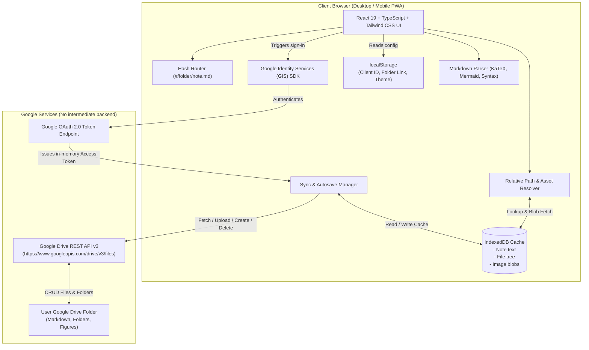

# MDCloud: Multi-Device Google Drive Markdown Note-Taking & Figure Viewer Web App
## Design Specification

**Date:** 2026-09-16  
**Status:** Approved by User  
**Target Repository:** `MDCloud`  
**Hosting Target:** GitHub Pages (Static Single Page Application)  

---

## 1. Executive Summary & Problem Statement

Users frequently write and study technical notes in Markdown that rely on external figures (charts, diagrams, screenshots) and LaTeX mathematical formulas. While tools like Obsidian or local editors handle relative figures (``), synchronizing them smoothly across multiple personal devices (laptops, desktops, tablets, smartphones) without vendor lock-in, recurring subscription fees, or complex Git merge conflicts is difficult.

**MDCloud** is a client-side Single Page Application (SPA) designed to be hosted directly on **GitHub Pages**. It connects directly to a designated **Google Drive folder** using Google Identity Services (GIS) and the Google Drive REST API. 

### Key Constraints & Guarantees:
* **Zero Secrets in Git**: The repository contains no API keys, client secrets, or user IDs. The codebase is 100% public-repo safe.
* **In-App User Credentials**: Users enter their personal Google Cloud OAuth 2.0 Client ID and their Google Drive folder link once via an in-app setup modal. These details are stored exclusively in the browser's `localStorage`.
* **Automatic Relative Figure Resolution**: Markdown image paths (such as `` or ``) are dynamically resolved against the note's parent folder in Google Drive, fetched as blobs, and rendered seamlessly in the browser.
* **Dual-Pane Note-Taking Environment**: Features a split-view editor and live preview on desktop, a tabbed toggle on mobile, with native support for KaTeX math ($math$), Mermaid diagrams, code syntax highlighting, and GFM tables.
* **Progressive Web App (PWA)**: Installable as an app on iOS, Android, macOS, and Windows with offline-resilient IndexedDB caching.

---

## 2. System Architecture



### 2.1 Technology Stack
* **Framework**: React 19, TypeScript
* **Build Tool**: Vite (configured with `base: './'` for GitHub Pages compatibility)
* **Styling**: Tailwind CSS (with full dark and light mode support)
* **Icons**: `lucide-react`
* **Markdown Pipeline**: `react-markdown`, `remark-gfm`, `remark-math`, `rehype-katex`, `rehype-highlight`, `mermaid`
* **Local Storage / Caching**: `idb` (lightweight Promise-based IndexedDB wrapper)
* **PWA**: `vite-plugin-pwa` (Workbox service worker + web app manifest)
* **CI/CD**: GitHub Actions (`deploy.yml` pushing to GitHub Pages environment)

---

## 3. Detailed Subsystem Specifications

### 3.1 Security & Credential Management
1. **Public Repository Safety**:
   * No API keys, OAuth client secrets, or private URLs are ever committed to git.
   * Google OAuth 2.0 Web Client IDs are public identifiers that restrict execution to specified Authorized JavaScript Origins (e.g. `https://<username>.github.io` and `http://localhost:5173`).
2. **First-Run Setup Modal**:
   * If `localStorage.getItem('mdcloud_config')` is empty, the app opens a non-dismissible setup wizard guiding the user:
     * **Step 1**: Create a free Google Cloud project, enable Google Drive API, and create an OAuth 2.0 Client ID (Application type: "Web application") with authorized origins.
     * **Step 2**: Enter the **Google OAuth Client ID** (`...apps.googleusercontent.com`).
     * **Step 3**: Enter the **Google Drive Folder Link** (e.g. `https://drive.google.com/drive/folders/1XYZ...`) or raw Folder ID. The app automatically extracts the ID.
3. **Session & Token Management**:
   * Uses Google Identity Services (GIS) `google.accounts.oauth2.initTokenClient`.
   * Scope requested: `https://www.googleapis.com/auth/drive`.
   * Access tokens are retained strictly in memory (React state) and never saved to unencrypted persistent storage.
   * Auto-refresh: When a Google Drive API call returns `401 Unauthorized`, the client triggers a silent token refresh or prompts the user to re-authorize.
   * Quick Disconnect / Reset: Settings modal provides a "Clear All Credentials & Cache" button to reset the app instantly.

---

### 3.2 Google Drive Integration Service (`DriveService`)
The app communicates with Google Drive REST API v3 using standard `fetch` requests with the Bearer token:

* **`listChildren(folderId: string)`**:
  * Query: `'${folderId}' in parents and trashed = false`
  * Fields: `files(id, name, mimeType, modifiedTime, size, parents)`
* **`readFileContent(fileId: string)`**:
  * Endpoint: `GET https://www.googleapis.com/drive/v3/files/${fileId}?alt=media`
  * Returns text content for Markdown files, or Blob for images/binary files.
* **`writeFileContent(fileId: string, content: string)`**:
  * Updates existing file via multipart or media upload:
    `PATCH https://www.googleapis.com/upload/drive/v3/files/${fileId}?uploadType=media`
* **`createFile(name: string, parentFolderId: string, content: string | Blob, mimeType: string)`**:
  * Multipart upload creating a new file within `parentFolderId`:
    `POST https://www.googleapis.com/upload/drive/v3/files?uploadType=multipart`
* **`createFolder(name: string, parentFolderId: string)`**:
  * Creates folder with `mimeType: "application/vnd.google-apps.folder"`.
* **`deleteItem(fileId: string)`**:
  * Trashes or removes the file/folder:
    `DELETE https://www.googleapis.com/drive/v3/files/${fileId}`
* **`renameItem(fileId: string, newName: string)`**:
  * `PATCH https://www.googleapis.com/drive/v3/files/${fileId}` with `{ name: newName }`.

---

### 3.3 Folder Tree Model & Relative Path Image Resolution

#### Directory Tree Structure
The app represents the folder hierarchy in memory as a virtual tree:
```typescript
interface DriveNode {
  id: string;
  name: string;
  mimeType: string;
  isFolder: boolean;
  parentId: string | null;
  children?: DriveNode[];
  modifiedTime?: string;
}
```

#### Relative Image Resolution Algorithm (`PathResolver`)
When viewing note `FolderA/SubB/Note1.md`:
1. Markdown parser encounters `` or `` or ``.
2. `PathResolver` splits the relative path by `/`:
   * Identifies the current note's parent folder (`SubB`).
   * Handles `.` (current folder), `..` (traverse to parent folder `FolderA`), and named directory segments (`figures`).
   * Resolves the target filename (`chart.png`) within the target folder node.
3. Retrieves the target file's Google Drive `fileId`.
4. **Cache & Blob Retrieval**:
   * Queries IndexedDB `image_blobs` store by `fileId`.
   * **Cache Hit**: Creates an object URL `URL.createObjectURL(blob)` and renders immediately.
   * **Cache Miss**: Calls `DriveService.readFileContent(fileId)` to fetch the image `Blob`, writes to IndexedDB, creates `blob:` URL, and updates the image element.
5. Handles web URLs: Any `src` beginning with `http://`, `https://`, or `data:` bypasses the resolver and loads standard external media.

#### Image Drag & Drop and Clipboard Paste
* While editing a markdown note, pasting an image (Ctrl+V / Cmd+V) or dragging an image into the editor:
  1. Prompts or auto-saves the image file into the current note's folder (or a `./figures/` subfolder).
  2. Uploads the image binary to Google Drive via `DriveService.createFile`.
  3. Inserts `` at the editor cursor position.
  4. Caches the blob in IndexedDB for instant preview rendering without waiting for Drive re-download.

---

### 3.4 Local Caching & Offline Resilience (IndexedDB)
Using `idb`, the app maintains three object stores:
1. **`tree_cache`**:
   * Key: `folderId`
   * Value: `{ children: DriveNode[], lastFetched: number }`
2. **`notes_cache`**:
   * Key: `fileId`
   * Value: `{ fileId, folderId, name, content, modifiedTime, isDirty: boolean, localDraft?: string }`
3. **`image_cache`**:
   * Key: `fileId`
   * Value: `{ fileId, blob: Blob, mimeType: string, modifiedTime: string }`

#### Autosave & Sync Strategy
* **Debounced Local Save**: Every keystroke updates React state and saves to `notes_cache` (debounced 300ms) with `isDirty = true`.
* **Debounced Drive Sync**: 1500ms after user stops typing (or immediately on `Cmd+S` / `Ctrl+S`), the app sends the updated markdown string to Google Drive. Upon success, marks `isDirty = false` and updates `modifiedTime`.
* **Status Badge**:
  * `● Saved to Drive` (Green indicator)
  * `○ Saving to Drive...` (Amber spinning indicator)
  * `☁ Saved Locally (Offline)` (Blue indicator if network unavailable)
  * `⚠️ Sync Error` (Red indicator with retry button)

---

### 3.5 UI / UX & Workspace Layout

#### 1. Three-Section Responsive Layout
* **Sidebar (Collapsible File Explorer)**:
  * Tree view of folders and notes with nested indentation.
  * Context menu (right-click or kebab icon): New Note, New Folder, Rename, Delete, Download.
  * Search bar: real-time client-side filter by title and note content.
  * Collapsible via toggle button or `Esc` key.
* **Workspace Header**:
  * Breadcrumb: `Drive Root > Mathematics > Calculus.md`.
  * Sync status indicator badge.
  * Layout mode switch: `Split View` | `Editor Only` | `Reader Only`.
  * Dark / Light mode toggle.
  * Settings button (OAuth config, folder link, export/import config).
* **Dual-Pane Workspace (Desktop)**:
  * Left: Markdown Editor (clean text editor with line numbers, code indentation, markdown shortcuts toolbar).
  * Right: Formatted HTML Preview with synchronized scrolling.
* **Mobile / Tablet Workspace**:
  * Tabbed switcher between `[Edit]` and `[Preview]` tabs.
  * Touch-friendly drawer for file navigation.

#### 2. Rich Markdown Capabilities
* **KaTeX (LaTeX Math)**:
  * Inline math: `$E = mc^2$`
  * Block math:
    ```text
    $$\int_{-\infty}^{\infty} e^{-x^2} dx = \sqrt{\pi}$$
    ```
* **Mermaid Diagrams**:
  * Code blocks tagged with ````mermaid render automatically into interactive SVG diagrams (flowcharts, sequence diagrams, state diagrams).
* **Syntax Highlighting**:
  * Language-aware code blocks with copy-to-clipboard button.
* **GFM Support**:
  * Tables, interactive task checkboxes (`- [x] Done`), strikethrough, blockquotes.
* **Image Lightbox**:
  * Clicking an image in the preview opens a full-screen zoomable lightbox viewer.

---

### 3.6 PWA & Deployment Architecture

#### 1. GitHub Pages Configuration
* Vite configured with `base: './'`.
* Hash-based routing (`#/folder-id/file-id`) ensures flawless deep linking and page refreshes on GitHub Pages without HTTP 404 redirects.

#### 2. Progressive Web App (PWA) & iOS/iPadOS Home Screen Support
* **Native iPad and iPhone Home Screen Installation**:
  * Configured via `vite-plugin-pwa` and custom HTML head tags for Apple devices:
    * `<meta name="apple-mobile-web-app-capable" content="yes">`
    * `<meta name="apple-mobile-web-app-status-bar-style" content="black-translucent">`
    * `<meta name="apple-mobile-web-app-title" content="MDCloud">`
    * `<link rel="apple-touch-icon" href="./apple-touch-icon.png">`
    * Safe area insets handled in CSS (`env(safe-area-inset-top)`, `env(safe-area-inset-bottom)`) so the iPhone notch/dynamic island and iPad home bar never obscure the editor or navigation.
  * **iOS "Add to Home Screen" Assistance**:
    * When viewed on iOS/iPadOS Safari in non-standalone mode, the app displays a lightweight helper badge or prompt: *"To install on iPad/iPhone: tap Share (⎋) > Add to Home Screen (➕)"*.
  * On Mac/Desktop, it works seamlessly as a standard responsive web application in any modern browser (Chrome, Safari, Firefox, Edge) or can be installed as a Chrome/Edge PWA if desired.

#### 3. Automated GitHub Actions Workflow (`.github/workflows/deploy.yml`)
* Automatically builds and deploys to GitHub Pages on every push to `main`:
  1. `git checkout`
  2. Setup Node.js 20+
  3. `npm ci`
  4. `npm run test` (unit tests for path resolver, markdown plugins)
  5. `npm run build`
  6. Deploy `dist/` to GitHub Pages using `actions/deploy-pages@v4`.

---

## 4. Verification & Testing Strategy

1. **Unit Tests (Vitest)**:
   * `PathResolver`: Test relative path resolutions (`./fig.png`, `../other/fig.png`, `figures/plot.svg`, non-existent paths, root-relative paths).
   * `DriveService Parser`: Test parsing Google Drive folder URLs to extract the folder ID.
   * `Markdown Rendering`: Test rendering KaTeX math blocks, code blocks, tables, and custom image tags.
2. **Integration Tests (Mock Google Drive API)**:
   * Mock Google Identity Services OAuth token issuance.
   * Mock Google Drive REST API endpoints (`files.list`, `files.get`, `files.create`, `files.patch`).
   * Test offline caching in IndexedDB and offline-to-online sync queue.
3. **End-to-End Browser Verification**:
   * Build production bundle (`npm run build`).
   * Verify PWA manifest, service worker registration, and zero console errors.

---

## 5. Implementation Roadmap (Phases for writing-plans)

1. **Phase 1: Project Scaffolding & Core Foundations**
   * Vite + React 19 + TypeScript + Tailwind CSS setup with PWA plugin.
   * Vitest test harness setup.
   * Configuration store (`localStorage`) and First-Run Setup Wizard.
2. **Phase 2: Google Identity & Drive API Service**
   * GIS script loader and OAuth 2.0 token management.
   * Google Drive API v3 REST client (list, read, write, create, delete, upload).
   * Mock Drive Service for development and offline testing.
3. **Phase 3: Storage Engine, Path Resolver & IndexedDB Caching**
   * Virtual tree management and file hierarchy state.
   * Relative path resolution engine for images and markdown assets.
   * IndexedDB persistence layer (`idb`) for notes, folders, and image blobs.
4. **Phase 4: Markdown Engine & Figure Viewer**
   * Custom markdown renderer with KaTeX, Mermaid, syntax highlighting, and GFM.
   * Custom image component that bridges relative paths with blob URLs and IndexedDB caching.
   * Lightbox image viewer modal.
5. **Phase 5: Dual-Pane Editor & Note-Taking Workspace**
   * Dual-pane responsive workspace (split view desktop, tabbed mobile).
   * Markdown editor with formatting toolbar and shortcut keys.
   * Drag-and-drop & clipboard image paste uploader.
   * Debounced autosave & real-time sync status indicator.
6. **Phase 6: File Explorer Sidebar & Search**
   * Folder tree sidebar with creation, renaming, and deletion modals.
   * Fuzzy search across notes and content.
   * Settings modal (credential update, configuration export/import, theme toggle).
7. **Phase 7: PWA, CI/CD & GitHub Pages Deployment**
   * PWA manifest, service worker offline caching, and icons.
   * GitHub Actions workflow for automatic deployment.
   * Comprehensive end-to-end verification and documentation (README setup guide).
